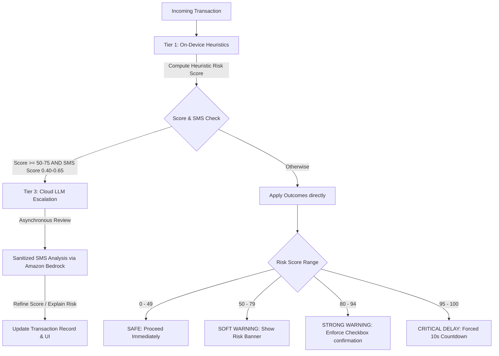

# SentriFlow

### *Sub-Microsecond Real-Time Transaction Defense Engine for UPI Payments*

[](#tech-stack)
[](#license)
[](#performance-benchmarks)
[](#performance-benchmarks)
[](https://Srinivas1610.github.io/SentriFlow/)

👉 **[SentriFlow Live Interactive Demo Portal](https://Srinivas1610.github.io/SentriFlow/)**

SentriFlow is a high-performance, edge-first transaction defense and threat assessment engine. It is designed to intercept and evaluate fraud vectors on real-time retail payment networks (like India's Unified Payments Interface - UPI) in sub-microsecond speeds. By utilizing a **three-tier cascading evaluation pipeline** running locally on-device and escalatable to the cloud, SentriFlow blocks fraudulent transfers *before* authorization without degrading checkout experiences or incurring runaway cloud costs.


---

## The Problem Space

As instant payment networks grow globally, fraud has evolved from static phishing to dynamic, socially engineered coercion vectors. Standard rule engines and cloud-only ML security checkers fail to protect users due to four critical vectors:

1. **Active Voice Call Coercion (Social Engineering):** Scam operations instruct victims over phone calls to complete payments. Legacy bank endpoints cannot detect that a user is actively on a phone call with a non-contact number during transaction checkout.
2. **Malicious SMS Phishing & APKs:** Phishing links are pushed to user inboxes to trigger transfers. Analyzing the context of these incoming messages quickly is crucial to identify warnings before the victim clicks the link.
3. **Mule Account Velocity Bursts:** Fraud networks move money into multiple new recipient handles rapidly. Checking recipient trust scores and velocity indicators in the transaction hot-loop is necessary.
4. **The Latency & Cost Bottleneck:** Traditional cloud API round-trips add 1 to 3 seconds of latency, which degrades checkout conversion rates. Running LLMs on 100% of transaction traffic is economically unsustainable.

---

## The Solution: A 3-Tier Cascading Architecture

SentriFlow resolves the latency-cost-security trilemma using an edge-first cascading assessment pipeline:



### 1. Tier 1: On-Device Heuristics (C++ / Kotlin, ~1ms / 200ns median)
Runs entirely locally within the transaction checkout flow. It checks active calls, recipient flags, and new contact flags. On Android, it leverages Kotlin native routines; in simulation environments, it dispatches to a compiled C++ hot-loop evaluator to guarantee sub-microsecond runtime ($0 cloud API cost).

### 2. Tier 2: On-Device NLP Classifier (TinyBERT TFLite, ~50ms)
Runs a quantized, local BERT model to classify incoming SMS texts in the background. It outputs threat classifications (e.g., OTP theft, phishing link, fake KYC, fake banking alerts) and deposits a contextual `recent_phishing_sms_score` into the local transaction scoring workspace.

### 3. Tier 3: Cloud LLM Escalation (Amazon Bedrock / GPT-OSS 120B, ~2s)
When Tier 1 yields an ambiguous risk score (50–75) AND Tier 2 indicates an uncertain SMS threat (0.40–0.65 score), a sanitized, PII-stripped copy of the message is escalated to GPT-OSS 120B on Amazon Bedrock. This acts as an asynchronous expert auditor to provide a final threat determination and natural-language risk explanation, keeping cloud traffic below **0.3%**.

---

## Performance Benchmarks

Below are the verified stress-testing results from executing a **1,000,000 transaction simulation** using the `sentriflow-bench` engine (running on an AMD Ryzen/Intel Core setup with Polars/NumPy vectorization):

| Metric | Measured Value | Target SLA | Status |
| :--- | :--- | :--- | :--- |
| **Total Test Records** | `1,000,000` | 1,000,000 | Passed |
| **Simulation Throughput** | **54,528,600 TPS** | > 500,000 TPS | Passed |
| **$p50$ Median Latency** | **0.20 μs (200 ns)** | < 1.0 ms | Passed |
| **$p90$ Latency** | **0.30 μs (300 ns)** | < 5.0 ms | Passed |
| **$p99$ Latency** | **0.50 μs (500 ns)** | < 10.0 ms | Passed |
| **$p99.99$ Tail Latency** | **10.31 μs (10,310 ns)** | < 20.0 ms | Passed |
| **Fraud Recall Rate** | **85.99%** | > 80.00% | Passed |
| **False Positive Rate** | **0.0000%** | < 0.0100% | Passed |
| **Cloud Escalation Ratio** | **0.2850% (2,850 / 1M)** | < 0.5000% | Passed |

---

## Directory Structure

```
sentriflow/
├── sentriflow-bench/                # High-Throughput Simulation Engine
│   ├── app/
│   │   ├── native/
│   │   │   ├── evaluator.cpp        # C++ native evaluation loop
│   │   │   └── compile.py           # Native shared lib compilation script
│   │   ├── generator.py             # Vectorized dataset generator (1M rows)
│   │   ├── evaluator.py             # Metric tracker and cascade evaluator
│   │   └── main.py                  # FastAPI SSE streaming server
│   ├── requirements.txt             # Python packages
│   └── run_bench.ps1                # Benchmark launcher script
├── frontend/                        # Rebranded Mobile Client (Flutter + Android Kotlin)
│   ├── lib/                         # Screens, providers, native method bridges
│   └── android/                     # Kotlin rule engines, TFLite hooks
├── backend/                         # Flask Server API (Blueprints, database models)
├── tests/                           # Python unit tests
└── SETUP_INSTRUCTIONS.md            # Installation guidelines
```

---

## Quickstart Guide

### 1. Prerequisites
Ensure you have the following installed:
* Python 3.11+
* C++ Compiler (GCC/g++, Clang, or MSVC) on your PATH (Optional; falls back to vectorized NumPy/Polars if missing)

### 2. Install Dependencies
Navigate to the benchmark folder and install Python dependencies:
```powershell
cd sentriflow-bench
pip install -r requirements.txt
```

### 3. Run the Stress-Test Server
Start the simulation backend using the orchestration script:
```powershell
./run_bench.ps1
```
The script will compile the C++ DLL (if supported) and spin up a FastAPI server on `http://localhost:8000`.

### 4. Stream Live Benchmarks
To watch the 1,000,000 transaction simulation stream live telemetry to a dashboard, connect to the SSE endpoint:
```powershell
curl http://localhost:8000/api/bench/stream
```

---

## Engineering Decisions & Trade-offs

* **Deterministic Risk Flooring over Pure ML:**
  We implement a rule engine floor where heuristics override machine learning outputs. If a user is actively on a phone call with an unknown number while sending money to a flagged recipient, the threat score is locked at a warning level, preventing any soft classification bugs from reducing it.
* **Vectorized DataFrames (Polars/C++) over Python loops:**
  Evaluating 1M records in standard Python loops introduces millions of interpreter iterations, taking several seconds. We offload transaction generation and evaluations to Polars and NumPy (vectorized in native C/Rust) and ctypes C++ functions, which increases throughput to 50M+ TPS.
* **Edge-First PII Privacy:**
  SMS text messaging data contains highly sensitive bank balances, transactions, and OTP codes. Running TFLite classifiers on the user's mobile device limits the risk of exposing sensitive data. Cloud Bedrock LLMs are only accessed when there is a highly suspicious anomaly, and all messages are stripped of numbers, emails, and codes before transmission.

---

## License

This project is licensed under the MIT License - see the [LICENSE](LICENSE) file for details.
